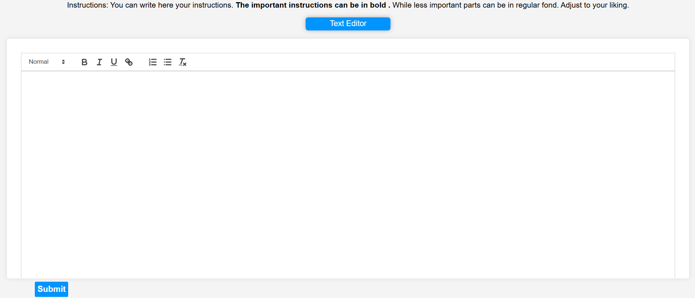
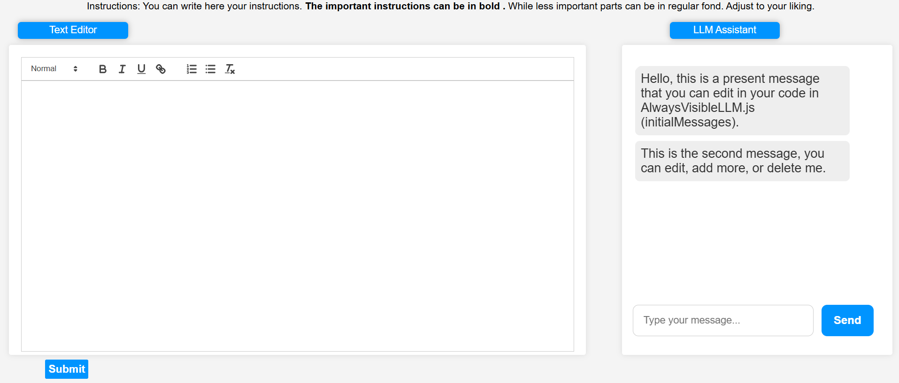
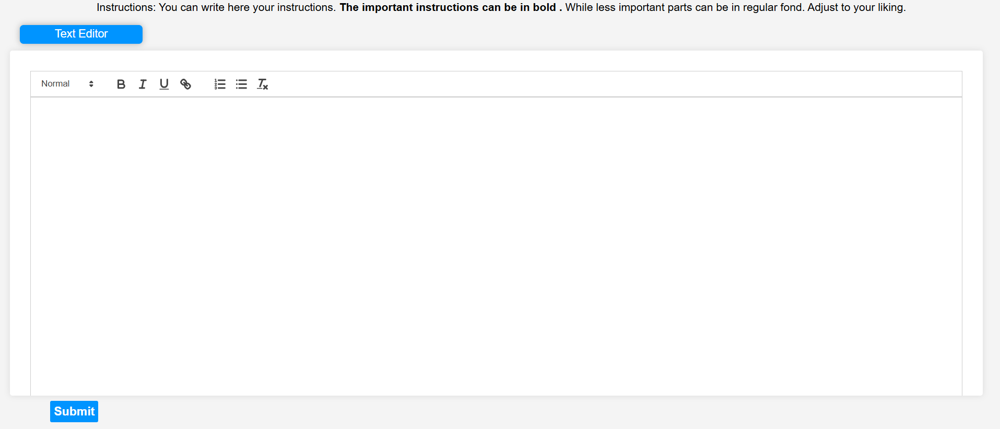
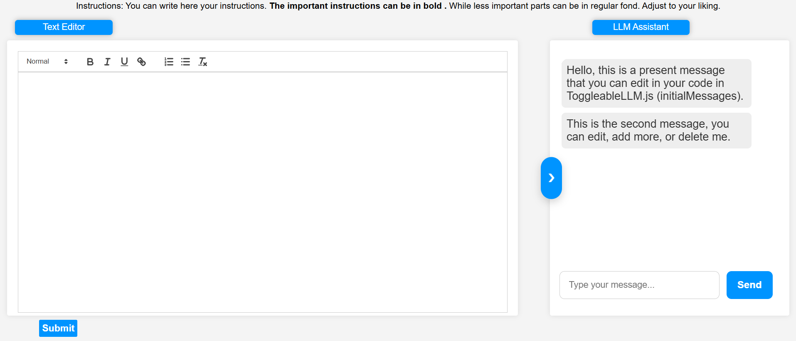
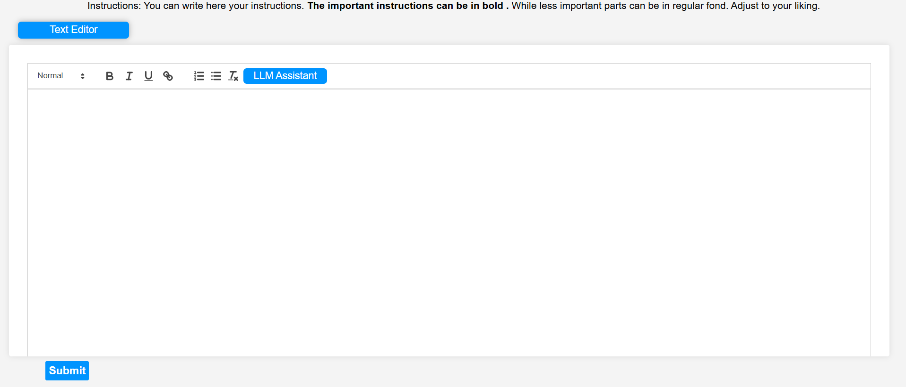
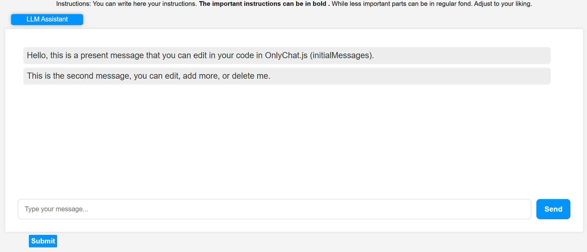
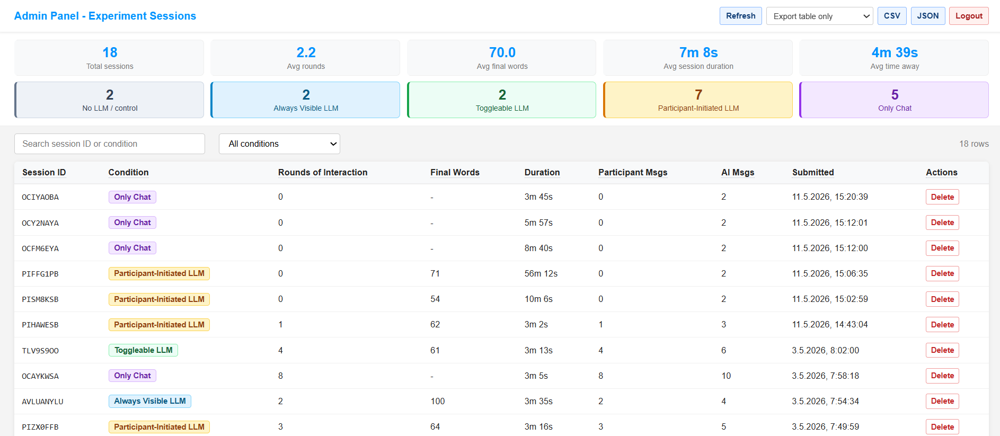

# A Tutorial for Using an Open-Source Platform for Controlled Experiments with LLM Assistance

This tutorial introduces a friendly, open-source foundation for controlled experiments on how people use large language model assistance while writing, revising, and making decisions.

This project is designed for psychology researchers, behavioral scientists, graduate students, and research labs that want to run web-based studies with carefully controlled LLM access conditions.

> [!NOTE]
> The platform is free and open-source, but deployed studies may incur costs from LLM providers and cloud services such as AWS or Azure.

## Table of Contents

**Understand the Platform**

- [What This Platform Does](#what-this-platform-does)
- [Who It Is For](#who-it-is-for)
- [Experiment Conditions](#experiment-conditions)
- [Researcher Dashboard](#researcher-dashboard)
- [Architecture](#architecture)

**Run and Adapt It**

- [Local Setup](#local-setup)
- [Customization Guide](#customization-guide)
- [Deployment Options](#deployment-options)

**Use the Data**

- [What Data Is Collected](#what-data-is-collected)
- [Data Analysis](#data-analysis)

**Project Reference**

- [Repository Map](#repository-map)
- [Troubleshooting](#troubleshooting)
- [License and Credits](#license-and-credits)

## What This Platform Does

The platform lets researchers run browser-based experiments where participants complete a writing task under different LLM-access conditions. Depending on the condition, participants may write without AI, see an always-visible assistant, toggle the assistant open and closed, initiate assistance only when needed, or interact with chat only.

It records study-relevant behavior such as:

- final submitted text
- text-editor progress snapshots
- chat messages between participant and LLM
- LLM provider/model configuration
- submit attempts and submit timestamps
- tab/window leave behavior
- assistant open/collapse events where applicable
- completion/session codes for matching with survey data

## Who It Is For

This repository is intended for:

| Audience | What You Can Do |
| --- | --- |
| Psychology and behavioral researchers | Run controlled experiments comparing different AI-assistance conditions. |
| Graduate students | Customize instructions, prompts, timing rules, and data exports without rebuilding the system from scratch. |
| Research labs | Deploy reusable studies with secure server-side API keys and downloadable logs. |
| Technical collaborators | Extend conditions, integrate additional providers, or add institution-specific deployment flows. |

> [!IMPORTANT]
> Participants should never see API keys, cloud credentials, admin passwords, or other secrets. Keep all secrets in backend/cloud environment variables, not in the React frontend code.

## Experiment Conditions

The current project includes five conditions. Each condition has its own route and completion-code pattern.

| Index | URL | Condition | Completion code pattern | Core manipulation |
| --- | --- | --- | --- | --- |
| 1 | `/c` | No LLM / control | `OLxxxxxC` | Text editor only, no AI access. |
| 2 | `/u` | Always Visible LLM | `AVLxxxxxU` | Text editor and assistant visible throughout the task. |
| 3 | `/o` | Toggleable LLM | `TLxxxxxO` | Text editor plus assistant that can be shown/collapsed. |
| 4 | `/b` | Participant-Initiated LLM | `PIxxxxxB` | Assistant opens only after the participant chooses to activate it. |
| 5 | `/a` | Only Chat | `OCxxxxxA` | Chat-only interaction without a separate text editor. |

### 1. No LLM / Control

Below is a screenshot of how this mode looks to participants.



Use this condition when you need a baseline for writing without LLM assistance. It supports questions about how outcomes differ when participants complete the task independently.

### 2. Always Visible LLM

Below is a screenshot of how this mode looks to participants.



Use this condition when the LLM should be highly available and continuously salient. It supports questions about reliance, cognitive offloading, writing quality, and behavior when assistance is always present.

### 3. Toggleable LLM

This condition is useful when you want to study how participants manage access to assistance over time.

Below are screenshots of how this mode looks before and after the assistant is visible.

| Before assistant is visible | After assistant is visible |
| --- | --- |
|  |  |

It supports questions about help-seeking, avoidance, attention, and whether participants choose to keep AI assistance visible.

### 4. Participant-Initiated LLM

Below is a screenshot of how this mode looks to participants.



Use this condition when you want the participant to make an explicit decision to request AI assistance. It is especially useful for studying thresholds for help-seeking and intentional AI use.

### 5. Only Chat

Below is a screenshot of how this mode looks to participants.



Use this condition when the LLM is the primary production medium rather than a support tool. It supports questions about prompting, delegation, authorship, and text generation through conversational interaction.

## Researcher Dashboard

The admin dashboard is available at:

```text
/admin/login
```

It lets researchers:

- view sessions stored in the configured log bucket
- filter sessions by condition
- inspect final submitted text and editor progress
- inspect chat messages and raw logs
- review derived metrics such as rounds of interaction, final word count, session duration, participant messages, and AI messages
- export table-only or full-session data as CSV or JSON
- delete a session when needed



> [!TIP]
> The dashboard password is controlled by `ADMIN_PASSWORD` in the backend or Lambda environment. Do not commit real admin passwords to GitHub.

## Architecture

At a high level, the platform separates participant-facing code from sensitive backend work.

```text
Participant browser
  |
  | React app: experiment routes, editor, chat UI, dashboard UI
  v
Backend API
  |
  | /api/ai           -> forwards chat requests to the selected LLM provider
  | /api/logs         -> saves experiment logs
  | /api/admin/login  -> authenticates dashboard access
  | /api/admin/sessions -> lists/deletes session files
  v
Cloud storage
  |
  | AWS S3 in the current deployment path
  | Azure Blob Storage in the Azure-equivalent path
  v
Researcher dashboard and analysis scripts
```

Current AWS deployment uses:

| Layer | AWS service |
| --- | --- |
| Frontend hosting | AWS Amplify |
| API routing | API Gateway HTTP API |
| Serverless backend | AWS Lambda |
| Experiment log storage | S3 |
| Local backend | Express server in `backend/server.js` |

See [AWS deployment guide](docs/deployment/aws.md) for the preserved deployment tutorial.

## What Data Is Collected

Each submitted session is saved as a `.txt` file containing JSON. The exact fields depend on the condition.

| Field | Meaning | Conditions |
| --- | --- | --- |
| `id` | Completion/session code. Also used as the saved file name. | All |
| `LLMProvider` | Provider selected in the condition page, for example `chatgpt`. | LLM conditions |
| `LLMModel` | Model selected in the condition page, for example `gpt-4o`. | LLM conditions |
| `backgroundLLMMessage` | Background instruction/context sent to the assistant. | LLM conditions |
| `messages` | Timestamped participant and assistant messages. | LLM conditions |
| `editor` | Timestamped text-editor snapshots. The last snapshot is the final submitted editor content. | Editor conditions |
| `chatEvents` | Assistant open/expand/collapse events. | Toggleable and Participant-Initiated |
| `ButtonPressed` | Time at which participant initiated assistant access. | Participant-Initiated |
| `NumOfSubmitClicks` | Number of submit attempts. | All |
| `TimeStampOfSubmitClicks` | Submit attempt timestamps in milliseconds. | All |
| `navigatedAway` | Number of tab/window leave events. | All |
| `totalNavigatedAwayMs` | Total time away from the experiment page. | All |
| `navigatedAwayExplained` | Detailed away/return episodes. | All |

For a more detailed researcher-facing explanation, see [Data and analysis](docs/data-and-analysis.md).

## Local Setup

### 1. Install Required Tools

Install:

- [Git](https://git-scm.com/install)
- [Node.js](https://nodejs.org/en/download)
- a code editor such as [Visual Studio Code](https://code.visualstudio.com/)

Check that Node and npm are available:

```bash
node -v
npm -v
```

### 2. Get the Code

Fork this repository on GitHub, then clone your fork:

```bash
git clone https://github.com/<YOUR_USERNAME>/AI_Assistant_Website.git
cd AI_Assistant_Website
git remote add upstream https://github.com/atilmansour/AI_Assistant_Website
git remote -v
```

### 3. Configure Environment Variables

Create a frontend `.env.local` file:

```env
REACT_APP_API_BASE=http://localhost:5050
```

Create `backend/.env` using [backend/.env.example](backend/.env.example) as a template:

```env
OPENAI_KEY=Bearer your_openai_key
GEMINI_KEY=your_gemini_key
CLAUDE_KEY=your_claude_key
GROQ_KEY=Bearer your_groq_key

ALLOWED_ORIGIN=http://localhost:3000
PORT=5050

REACT_APP_BucketS3=your_s3_bucket_name
ADMIN_PASSWORD=change_this_admin_password

REACT_APP_ACCESS_KEY_ID=your_aws_access_key_id
REACT_APP_SECRET_ACCESS_KEY=your_aws_secret_access_key
REACT_APP_REGION=your_aws_region
```

> [!CAUTION]
> Never commit `.env`, `.env.local`, or `backend/.env`. The repository keeps `.env.example` files because they are safe templates, not real secrets.

### 4. Run Locally

Open two terminals.

Backend:

```bash
cd backend
npm install
npm start
```

Frontend:

```bash
npm install
npm start
```

The app usually opens at:

```text
http://localhost:3000
```

Try condition routes such as:

```text
http://localhost:3000/c
http://localhost:3000/u
http://localhost:3000/o
http://localhost:3000/b
http://localhost:3000/a
http://localhost:3000/admin/login
```

## Customization Guide

Most researcher-facing customization points are marked in the code with:

```text
CONFIG YOU WILL EDIT
```

Search for that phrase in your editor.

Common changes:

| What you want to change | Where to look |
| --- | --- |
| Participant instructions | condition pages in `src/pages/` |
| Completion-code prefixes/suffixes | `getRandomString()` in each condition page |
| LLM provider/model | `LLMProvider` and `LLMModel` in LLM condition pages |
| Assistant background prompt | `backgroundAIMessage` in LLM condition pages |
| Initial assistant messages | `initialMessages` passed into `AI_API` |
| Minimum word/time rules | condition pages in `src/pages/` |
| Paste behavior | `pasteFlag` and `QuillTextEditor.js` |
| Routes/URLs | `src/pages/Routes.js` |
| Thank-you message | `src/pages/ThankYou.js` |
| Dashboard behavior | `src/pages/admin/` |
| Local backend/API logic | `backend/server.js` |
| AWS Lambda backend | `lambda/index.mjs` |

See [Customization guide](docs/customization.md) for a more detailed walkthrough.

## Deployment Options

| Platform | Status | Guide |
| --- | --- | --- |
| AWS | Current primary deployment path. Uses Amplify, Lambda, API Gateway, and S3. | [docs/deployment/aws.md](docs/deployment/aws.md) |
| Azure | Azure-equivalent architecture. Requires adding an Azure Functions + Blob Storage adapter because the current deployed backend is AWS-specific. | [docs/deployment/azure.md](docs/deployment/azure.md) |

> [!IMPORTANT]
> The AWS guide preserves the original technical deployment instructions and adds structure, admin-route coverage, and troubleshooting notes.

## Data Analysis

The `CodeAnalysisData/` folder contains Python scripts for extracting and analyzing saved study logs.

| Script | Purpose |
| --- | --- |
| `getPlainTexts.py` | Extract final plain-text submissions from log files. |
| `getMessagesInCSV.py` | Extract chat messages to CSV. |
| `writingPatterns.py` | Analyze writing bursts, pauses, and words added over time. |
| `consultationPatterns.py` | Analyze timing and distribution of LLM consultations. |
| `behaviorPostConsultation.py` | Compare writing behavior before and after consultation events. |
| `literalLLMLanguageIncorporation.py` | Estimate direct reuse of LLM-generated language. |
| `IndirectLLMLanguageIncorporation.py` | Estimate semantic similarity between final text and LLM responses. |

See [Data and analysis](docs/data-and-analysis.md).

## Repository Map

```text
AI_Assistant_Website/
  src/pages/                 experiment conditions and admin dashboard
  src/components/            text editor and LLM chat components
  backend/server.js          local Express backend
  lambda/index.mjs           AWS Lambda backend
  images/                    documentation screenshots
  CodeAnalysisData/          Python analysis scripts and example outputs
  exampleDataFiles/          example log files and derived example CSVs
  docs/                      deployment, customization, and data guides
```

## Troubleshooting

| Problem | What to check |
| --- | --- |
| `Failed to fetch` | Confirm `REACT_APP_API_BASE` points to the backend/API Gateway URL and does not include an extra trailing path. |
| Dashboard says `ADMIN_PASSWORD is not configured` | Set `ADMIN_PASSWORD` in `backend/.env` locally or Lambda environment variables in deployment. |
| CORS error | Confirm your frontend origin is allowed by the backend/Lambda and API Gateway configuration. |
| Logs are not saved | Confirm `REACT_APP_BucketS3` or `BUCKET_NAME` is set and the backend has storage permissions. |
| LLM replies fail | Confirm the selected provider key is configured and the provider/model name is valid. |
| Condition is not recognized in dashboard | Confirm the completion code pattern matches the expected prefix/suffix table above. |

## License and Credits

This project is released under the [MIT License](LICENSE). MIT is widely used for open-source scientific tooling because it allows reuse, modification, teaching, and research deployment while preserving attribution.

Developed by:

- Atil Mansour
- Ori Goldfryd
- Ofra Amir
- Liat Levontin
- Technion - Israel Institute of Technology

For questions, contact Atil Mansour at `atil@campus.technion.ac.il` or `atilxmansour@gmail.com`.
